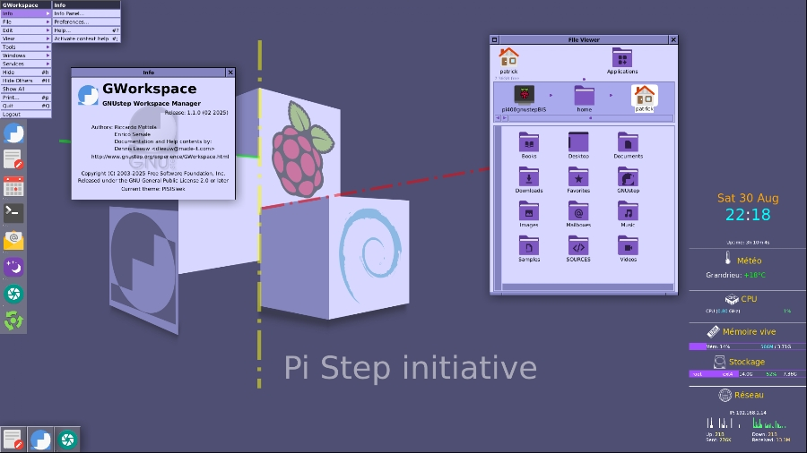
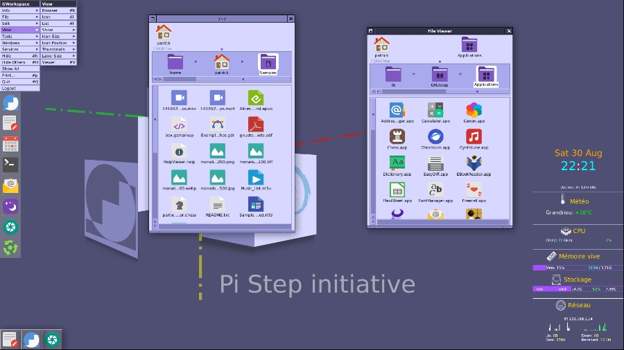

# A Pi-Step iNitiative (PiSiN)

## Abstract

- Setting a GNUstep compliant Desktop on a Raspberry Pi.
- **Release/Status**: see [RELEASE](pisin/RELEASE).
- The Operating System is Raspberry Pi OS Lite, itself based on Debian Bookworm, i.e. 12
- Roadmap: Trixie will be tested as soon as the RPI OS Lite will officially adopt the 13th Debian release.
- Short Name changed to 'PiSiN' to avoid misconfusion with an already existent GNU/Linux distro project.

## Detailed goals and targets

### Hardware choice

It is a [Raspberry Pi 400](https://www.raspberrypi.com/products/raspberry-pi-400/specifications/) because it is an affordable and well known hardware. It provides a simple way 
to change the operating system and to test another one by changing the SD card and booting this another system! What functions on my Pi 400 must function on all. It should also function on a Pi 4b model.

Model 3b has been also successfully tested (Sat 6 Sep 2025): see a [screenshot](./Screenshots/screenshot_PiSiN_on_3B.png).

**Roadmap**: Pi 500 will be tested on Jan. 2026.

### Audience

The targets of the project are two communities concerned: 

- The *GNUsteppers*: Users and Developers of the [GNUstep project](https://www.gnustep.org/);
- The *Young Learners* within the [Raspberry Pi Foundation](https://www.raspberrypi.org/) project. there is yet a great community around the Raspberry Foundation,  with Teachers and Learners. 

## Method

1) Building a consistent Desktop on the Pi 400 hardware: the average user should find there some familiar commodities like a Workspace (Desktop, FileManager, Dock) and also tools like a software updater, notifications and system monitoring...

2) Adding significant apps from GNUstep for the user experience and tools for the Developper: there are together a Showcase and a Workshop. See below.

3) Providing a finalized set of easy install scripts to build and setup the Desktop.

Until now, steps 1 to 3 are mostly done.
  - **Status**: complete install on a fresh SD card: done: ok | with a different username: done | On another Pi model (3B: done)

4) Adding helps and tutorials targeting the learning community of the Raspberry Pi 
 Foundation and new GNUstep incoming developers: (begun).
  - A 'PiSiN User Guide' and a 'GWorkspace User Guide' are provided in the 'Books' folder.
  - **Roadmap**: a 'Developer User Guide' should be the next major Help contribution.

---

## The PiSiN Desktop

### Screenshots of the current release

[Magnify](./Screenshots/Screenshot_V01_Home.jpg)

[Magnify](./Screenshots/Screenshot_V01_Apps.jpg)

### PiSiN Components as Brief

- PiSiN provides a set of Bash Scripts to fetch, build, install and customize the whole Desktop.
- The GNUstep environment is built from the latest sources of the Libraries, Tools and Apps: unlike some other great projects like NEXTSPACE and GS-Desktop, I am using legacy Window Maker and GWorkspace...
- PiSiN provides its original Themes: 'PISIN.theme' for GNUstep and 'PISIN.themed' for Window Maker. I tried to give a strong GNUstep identity (vertical menus and Dock) but with customized colors and modern icons. Most of these icons were adapted from the [Papirus Iconset project](https://github.com/PapirusDevelopmentTeam/papirus-icon-theme). Several are my own work as the WallPaper too.
- The Monitoring board on the Desktop is using [Conky](https://github.com/brndnmtthws/conky).
- Read the [RELEASE](./pisin/RELEASE) file to get the complete and detailed list of the components and Apps provided.
- User Guides (.help format for HelpViewer app)

### How to install

- Read the [INSTALL](./pisin/INSTALL) guide to know how to fetch and build PiSiN.

## Thanks and Tributes

This project is a little piece amount the great work of a community for decades. I would thanks the people who kindly answered my newbie questions on the GNUstep Discuss List. I was also inspired by the theming works of Bertrand Deconinck and the Sleek theme by Riccardo Mottola. I also used some apps from the GS-Desktop project by Florian Ondrej (alias Onflapp on Github).

